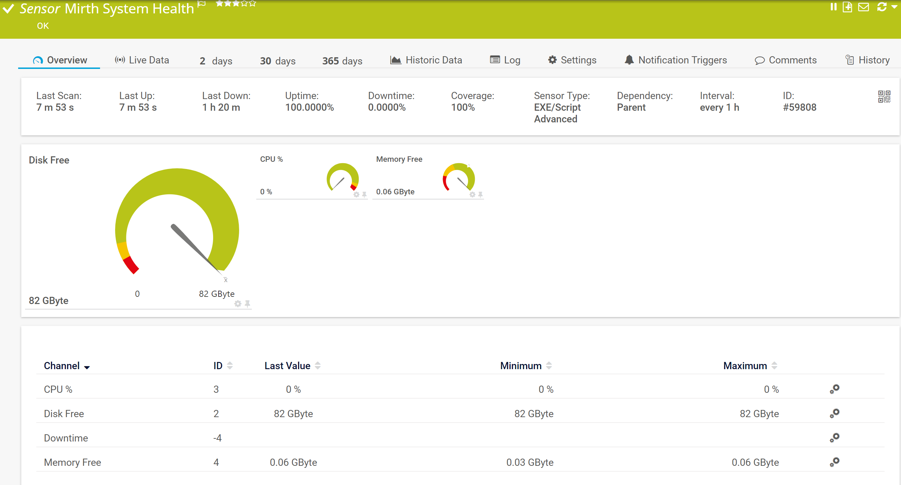
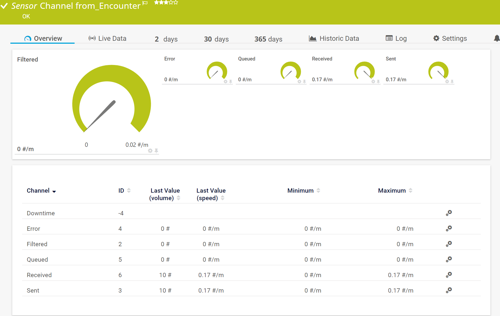

# Monitoring NEXTGEN Connect (Mirth Connect) using PRTG

With this powershell script you are able to monitor your [NEXTGEN Connect](https://www.nextgen.com/products-and-services/integration-engine) installation. 

### Installation
- Deploy prtg_mirth.ps1 to <prtg_folder>\custom sensors\EXEXML
- Deploy prtg_mirth_template.odt to <prtg_folder>\templates

Following metrics can be monitored:
 
#### Mirth System Health:
- CPU %
- Free Memory
- Free Disk Space

```
prtg_mirth.ps1 <IP/DNS> <port> <username> <password> "system" 
```



#### Channel <Channel Name>:
- Received
- Sent 
- Filtered
- Error
- Queued

```
prtg_mirth.ps1 <IP/DNS> <port> <username> <password> "channel" <channelID> 
```


# Auto-Discovery support via Template
  - Select "NEXTGEN (Mirth) Connect" template in Device Settings as template
  - Run Auto-Discovery with specified template
  - Newly added channels from Mirth will be added in PRTG if you schedule a reoccuring Auto-Discovery for this Device

# Debugging
- Add -Verbose parameter to enable logging to console
